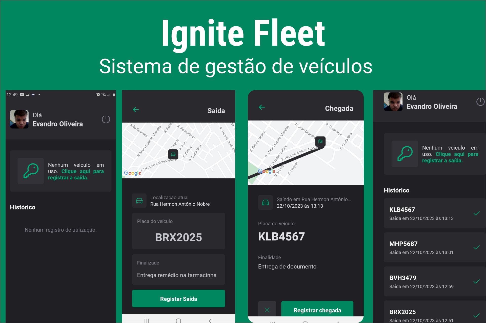

<h1 align="center"> IgNite fleet </h1>

Sistema para gestão de veículos.  

  <a href="#-tecnologias">Tecnologias</a>&nbsp;&nbsp;&nbsp;|&nbsp;&nbsp;&nbsp;
  <a href="#-projeto">Projeto</a>&nbsp;&nbsp;&nbsp;|&nbsp;&nbsp;&nbsp;
  <a href="#-layout">Layout</a>&nbsp;&nbsp;&nbsp;|&nbsp;&nbsp;&nbsp;
  <a href="#memo-licença">Licença</a>

  

 

## 🚀 Tecnologias

Esse projeto foi desenvolvido com as seguintes tecnologias:

- React Native
- Expo
- styled-components
- MongoDb
- Relm
- Async-storage
- Dayjs
- Git e Github
- Figma

## 💻 Projeto

O Ignite fleet é um projeto desenvolvido com expo para gestão de veículos

